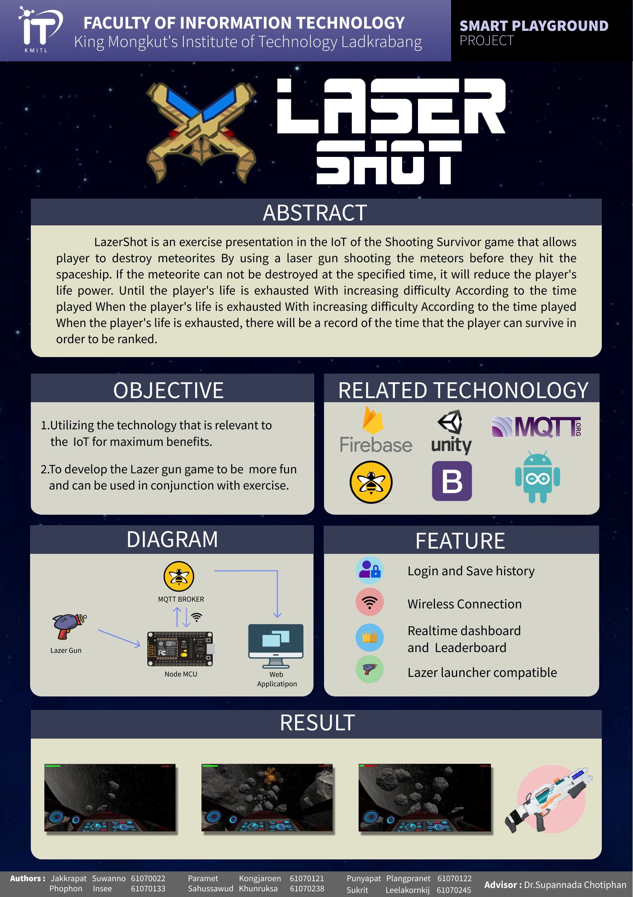

# LazerShot
<li> 🏠 Abstract </li>
  LazerShot is an exercise  presentation in the IOT of the Shooting Survivor game that allows player to destroy meteorites By using a laser gun shooting the meteors before they hit the spaceship. If the meteorite can not be destroyed at the specified time, it will reduce the player's life power. Until the player's life is exhausted With increasing difficulty According to the time played When the player's life is exhausted With increasing difficulty According to the time played When the player's life is exhausted, there will be a record of the time that the player can survive in order to be ranked.

 

